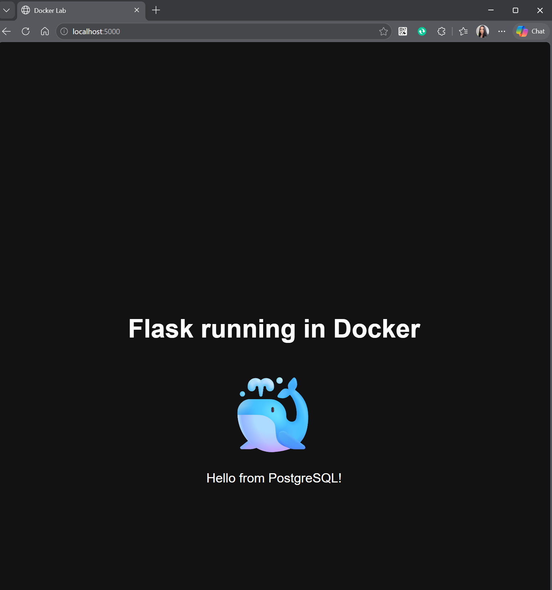
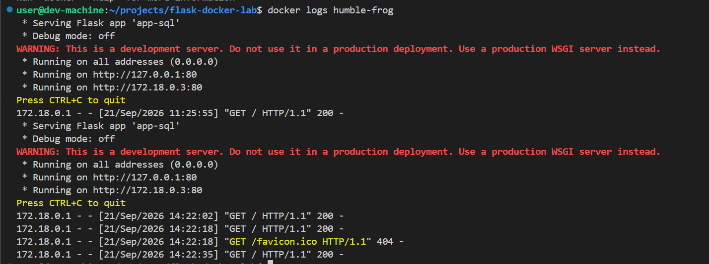

# Flask Docker Lab

Simple Docker practice project with a Flask application and PostgreSQL.



## Technologies

- Python
- Flask
- Docker
- Docker Compose
- PostgreSQL

## Actions

- Building Docker images
- Running containers
- Port mapping
- Using Docker Compose
- Connecting a Flask application to PostgreSQL
- Inspecting containers and checking logs

## Run the project

```bash
docker compose up --build
```

## Checking logs
```
docker logs humble-frog
```
The Flask application is running inside the Docker container and listening on all container interfaces (`0.0.0.0`) on port `80`.


```
docker inspect humble-frog > container-configuration.json
```

## Enter the container

```
docker exec -it humble-frog /bin/sh
```